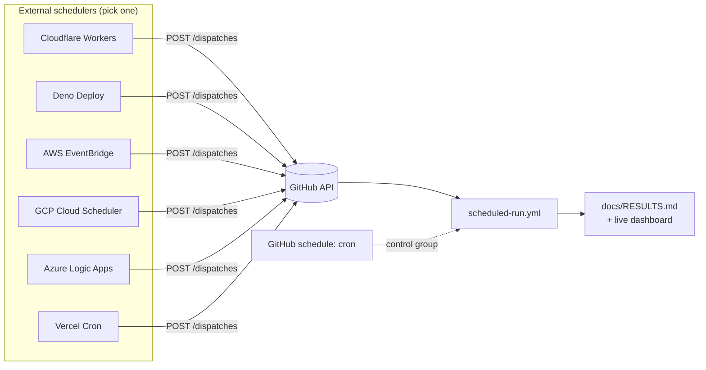

# actions-external-cron

**GitHub Actions' `schedule:` trigger is best-effort. This repo replaces it with external
schedulers, then measures whether that actually helped.**

GitHub [documents](https://docs.github.com/en/actions/reference/workflows-and-actions/events-that-trigger-workflows#schedule)
that scheduled workflows "may be delayed during periods of high loads of GitHub Actions
runs," and warns against scheduling at the top of the hour because that is when everyone
piles in. `workflow_dispatch` and `repository_dispatch` go through a different path and
are picked up promptly.

So: fire the schedule from somewhere else, and dispatch on demand.

**📊 [Live punctuality dashboard →](https://austenstone.github.io/actions-external-cron/)**



## The whole idea

Every example sends the identical request. The schedulers differ; the call does not.

```http
POST /repos/{owner}/{repo}/dispatches
Authorization: Bearer <token>
Accept: application/vnd.github+json

{"event_type": "scheduled-run", "client_payload": {"source": "cloudflare"}}
```

That is it. Everything else in this repo is either wrapper ceremony for a specific
platform, or measurement.

## Examples

| Scheduler | Auth | Reports timing | Retries | Cost |
| --- | --- | --- | --- | --- |
| [Cloudflare Workers](examples/cloudflare-worker/) | GitHub App | slot + fired | hand-rolled | free plan |
| [Deno Deploy](examples/deno-deploy/) | GitHub App | fired | built-in | free tier |
| [AWS EventBridge Scheduler](examples/aws-eventbridge/) | PAT (Secrets Manager) | slot | built-in | 14M/mo free |
| [GCP Cloud Scheduler](examples/gcp-cloud-scheduler/) | PAT (plaintext) | none | built-in | 3 jobs free |
| [Azure Logic Apps](examples/azure-logic-app/) | PAT (secure param) | fired | built-in | ~$0.01/mo |
| [Vercel Cron](examples/vercel-cron/) | PAT (env var) | fired | none | free (daily only) |

**Start with [Cloudflare](examples/cloudflare-worker/).** It is the only one that
combines short-lived GitHub App credentials, native knowledge of its intended slot, and no
infrastructure to provision.

## Results

**[Live dashboard →](https://austenstone.github.io/actions-external-cron/)** — ranked
leaderboard, median drift chart, and per-slot history, rebuilt automatically. The same
numbers land in **[docs/RESULTS.md](docs/RESULTS.md)** via
[`leaderboard.yml`](.github/workflows/leaderboard.yml). Methodology is in
[docs/PAYLOAD.md](docs/PAYLOAD.md).

All six schedulers target the same cron slot, and GitHub's native `schedule:` runs
alongside as the control group. If an external scheduler is not meaningfully better than
the control, that shows up in the table rather than in someone's anecdote.

Only the seven known scheduler sources are ranked. Ad-hoc dispatches and smoke tests are
ignored, because a run fired whenever a human felt like it has no meaningful drift.

## Running it yourself

1. Fork the repo. The receiving side needs no configuration —
   [`scheduled-run.yml`](.github/workflows/scheduled-run.yml) already listens for
   `repository_dispatch` and runs the native `schedule:` control.
2. Pick an example and follow its README. Each is standalone.
3. Set `source` to something unique per scheduler — that string is what the leaderboard
   groups by.
4. Wait a day, then check the [dashboard](https://austenstone.github.io/actions-external-cron/).

### Fastest path: deploy from Actions

Cloudflare and Deno are the two schedulers that are free *and* capable of hourly firing,
so both have a one-secret deploy workflow. Add the secrets and the scheduler ships itself:

| Scheduler | Add | Workflow |
| --- | --- | --- |
| Cloudflare | `CLOUDFLARE_API_TOKEN`, `CLOUDFLARE_ACCOUNT_ID`, `DISPATCH_TOKEN` | [`deploy-cloudflare.yml`](.github/workflows/deploy-cloudflare.yml) |
| Deno Deploy | `DENO_DEPLOY_TOKEN`, `DISPATCH_TOKEN` + `DENO_PROJECT` variable | [`deploy-deno.yml`](.github/workflows/deploy-deno.yml) |

`DISPATCH_TOKEN` is a fine-grained PAT on this repo with **Contents: write** — that is the
permission `POST /repos/{owner}/{repo}/dispatches` actually checks. Both workflows skip
cleanly with an explanatory job summary when the secrets are absent, so a fork never sees
a red X it did not ask for.

Vercel deliberately has no deploy workflow: Hobby-tier cron is capped at once per day, so
it cannot compete in an hourly leaderboard.

To adapt this for real work, replace the placeholder step in `scheduled-run.yml` with
whatever your nightly job actually does. The drift measurement is free to leave in.

## Honest caveats

Worth knowing before you rip out every `schedule:` in your org.

- **This does not fix runner queue time.** Dispatch gets the *run created* sooner. If your
  job then waits for a busy self-hosted pool or a constrained concurrency limit, you have
  a capacity problem, not a scheduling problem, and this changes nothing. The
  `queue time` column exists so you can tell the two apart.
- **You now own a second system's uptime.** GitHub's scheduler is late sometimes; your
  Cloudflare Worker can be broken entirely. Keep `schedule:` as a backstop — that is why
  it is still in the workflow — and add a guard so a doubled-up run is harmless.
- **`repository_dispatch` only runs on the default branch.** No exceptions. If you need a
  release branch, use `workflow_dispatch` with an explicit `ref`.
- **Rate limits are real.** 5,000 requests/hour for a PAT, and secondary limits punish
  bursts. Fine for hourly. Reconsider before scheduling something every 10 seconds.
- **Do not schedule at `:00`.** GitHub's own advice, and it applies to your external
  scheduler too if the bottleneck turns out to be run creation rather than the scheduler.
  This repo deliberately uses `:00` because measuring the worst case is the point.
- **Every "reliable" scheduler here is also best-effort.** Cloudflare, Vercel, and Logic
  Apps all decline to promise exact timing. The leaderboard is the only way to know
  whether their best-effort beats GitHub's.

## Licence

[MIT](LICENSE)
